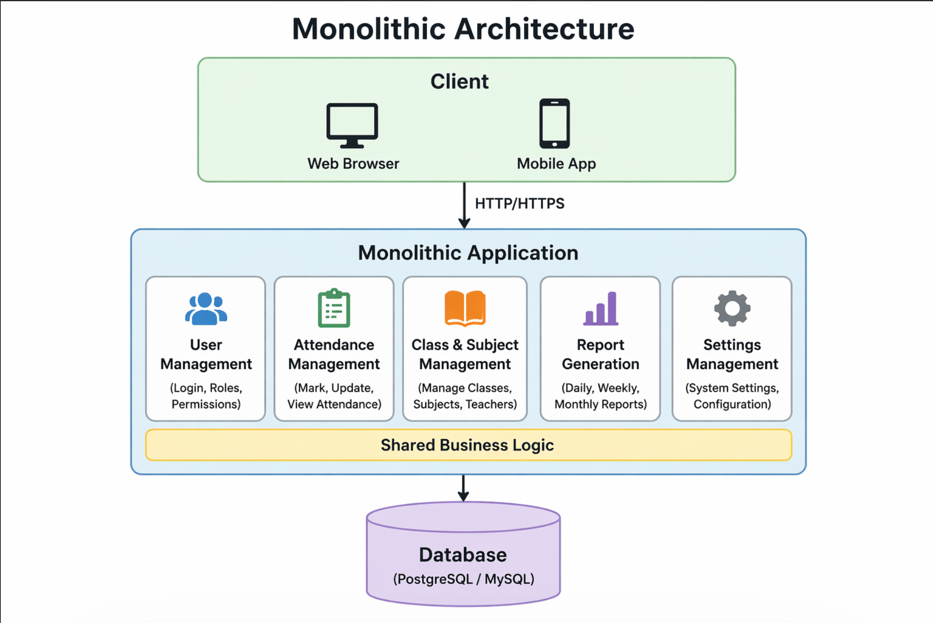

School Attendance System
System Requirements and Architecture
Stage 1. Requirements
Functional Requirements
1 Tizimda o‘quvchilarni ro‘yxatdan o‘tkazish imkoniyati bo‘lishi kerak (qo‘shish, tahrirlash, o‘chirish).
2 O‘qituvchilar har bir dars uchun o‘quvchilarning davomadini belgilay olishi kerak (keldi, kelmadi, kechikdi).
3 Sinflar va fanlarni yaratish hamda boshqarish imkoniyati bo‘lishi kerak.
4 Tizim davomad bo‘yicha hisobotlarni chiqarishi kerak (kunlik, haftalik, oylik).
5 Foydalanuvchilar tizimga login qilishlari kerak va rollar bo‘yicha ajratilishi kerak (admin, teacher, student).
Non-Functional Requirements
1 Tizim tez ishlashi kerak (so‘rovlar 1–2 soniyada bajarilishi maqsadga muvofiq).
2 Ko‘p foydalanuvchilar ishlatganda ham tizim ishlashda davom etishi kerak (scalability).
3 Ma’lumotlar xavfsizligi ta’minlanishi kerak (parollar shifrlangan holda saqlanadi).
4 Tizim doimiy ishlashi kerak (yuqori availability).
5 oydalanish oson bo‘lishi kerak (oddiy va tushunarli interfeys).

Monolithic Architecture

Afzalliklari:
1 Tuzilishi oddiy va tushunarli
2 Tez ishlab chiqish mumkin
3 Kichik loyihalar uchun juda qulay

Kamchiliklari:
1 . Tizim kattalashsa boshqarish qiyinlashadi
2 Scale qilish murakkab
3 Bitta xatolik butun tizimga ta’sir qilishi mumkin